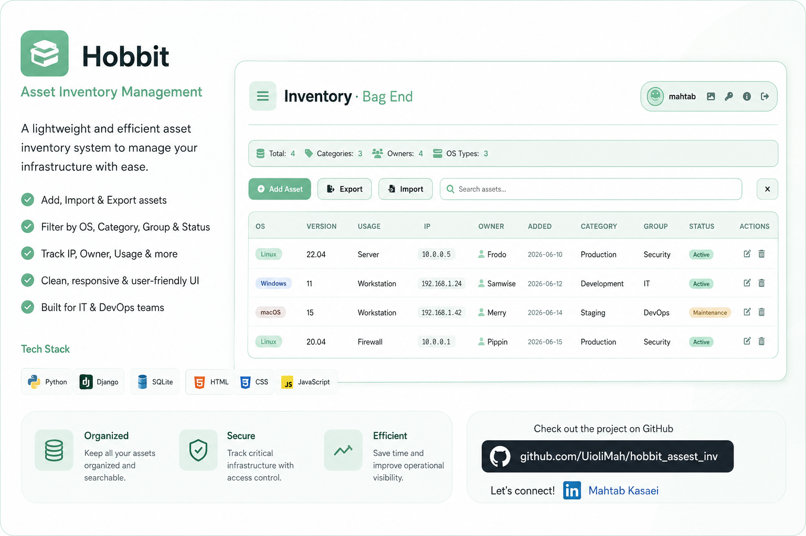

# Hobbit Asset Inventory

A Python-based asset inventory and discovery tool.fot the companies that always messy with the assets.

## Features

- Asset discovery
- Inventory collection
- Reporting

## Usage

```bash
python hobbit_assest_inv_v3.py
```
[ also change the password.]
 <p align="center">

</p>]

# Hobbit Asset Inventory

A lightweight asset inventory management system built with Django.

## Author

Mahtab kasaei
