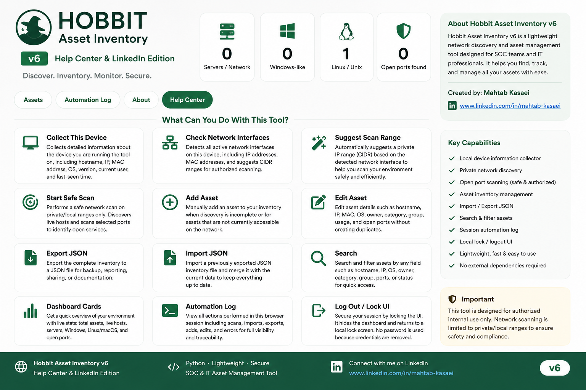

:::writing{variant="document" id="19473"}
# Hobbit Asset Inventory

<p align="center">
  
</p>

## About

**Hobbit Asset Inventory** is a lightweight Python-based asset inventory and discovery tool designed for teams that need a clean, simple, and practical way to manage messy assets.

It helps collect local device information, discover private network assets, organize inventory data, and export reports for documentation, SOC workflows, and GitHub sharing.

The tool runs locally in the browser and does not require a cloud account or hardcoded login credentials.

---

## Latest Version

**Hobbit Asset Inventory v6 - Help Center & LinkedIn Edition**

**Discover. Inventory. Monitor. Secure.**

---

## Key Features

- Local asset inventory management
- Local device information collector
- Private network interface discovery
- Suggested scan range based on detected interfaces
- Safe private/local network scanning
- Open port discovery for selected ports
- Add, edit, and delete assets
- Search and filter asset records
- JSON import and export
- Dashboard summary cards
- Automation log
- Help Center with full option descriptions
- About page with project and author information
- Local Lock / Logout UI
- No hardcoded username or password

---

## What This Tool Can Do

### Collect This Device

Collects information from the machine running the tool, including:

- Hostname
- Local IP address
- MAC address
- Operating system
- OS version
- Current user
- Last seen time

### Check Network Interfaces

Lists detected network interfaces and related information, such as:

- Interface name
- IP address
- MAC address
- Suggested private CIDR range

This helps you understand which local network ranges can be scanned safely.

### Suggest Scan Range

Automatically suggests a private scan range based on the detected local interface.

Example:

```text
192.168.1.0/24
